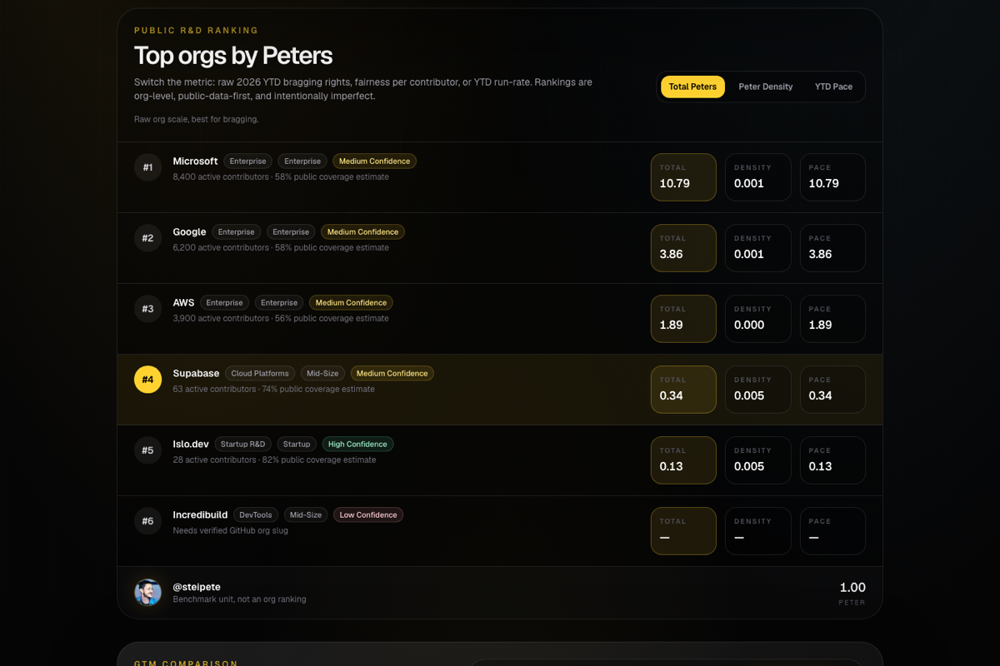
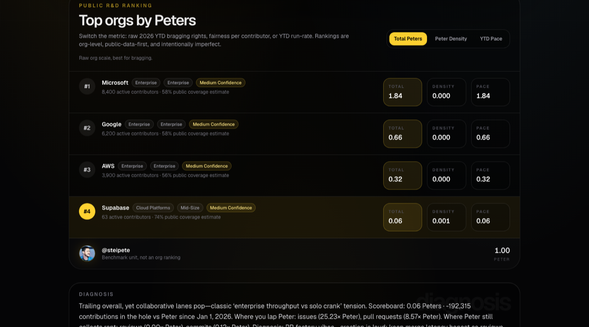
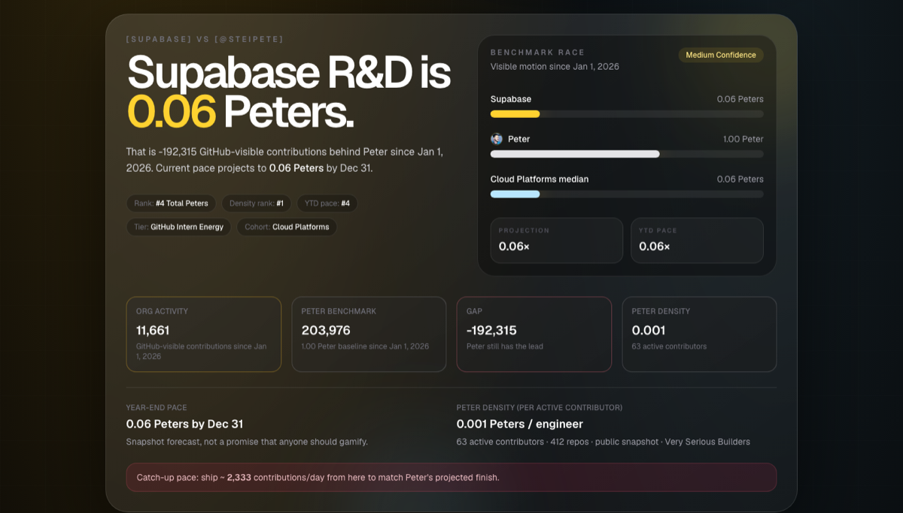
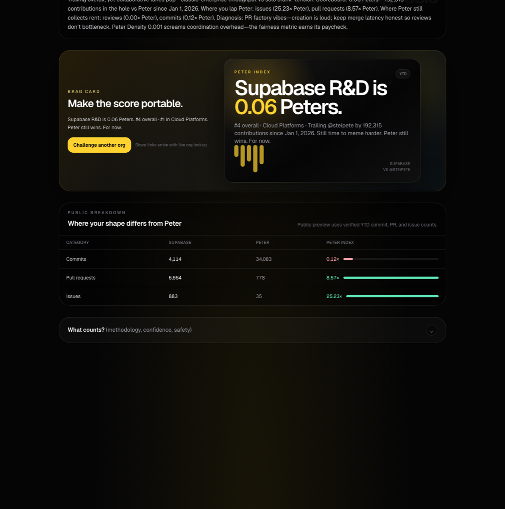

# How Many Peters?

> _Rank your GitHub R&D org against [@steipete](https://github.com/steipete) in one absurd, useful unit: **the Peter**._

A Next.js demo that takes verified 2026 YTD GitHub activity (commits, PRs, issues) and prices it in **Peters** — where `1 Peter = @steipete's YTD output as a solo developer`. It's part benchmark, part roast, part trust-building exercise about what GitHub-visible metrics can and can't say about an engineering org.

[](https://vercel.com/new/clone?repository-url=https%3A%2F%2Fgithub.com%2Fzozo123%2Fpeter-gt-your-org&project-name=peter-gt-your-org&repository-name=peter-gt-your-org)
[](./LICENSE)
[](https://nextjs.org/)
[](https://react.dev/)
[](https://tailwindcss.com/)



---

## What you get

Type any org slug (`supabase`, `microsoft`, `awslabs`, `vercel`, …) and the page renders:

- **Total Peters** — your YTD verified GitHub motion ÷ Peter's.
- **Peter Density** — Peters per active contributor. Keeps big orgs honest.
- **Momentum** — projected year-end totals at current pace.
- **Cohort rank** — you're compared against orgs your size, not just the whole field.
- **A diagnosis paragraph** — a roast/observation about whether you out-commit Peter, out-collaborate Peter, or quietly lose to Peter on density.

### Org leaderboard



### Side-by-side comparison



### Share card + category breakdown + methodology




---

## Quickstart

```bash
git clone https://github.com/zozo123/peter-gt-your-org.git
cd peter-gt-your-org
npm install
npm run dev
```

Open [http://localhost:3000](http://localhost:3000). No env vars required — the public preview ships with verified 2026 YTD snapshots for Supabase, Microsoft, Google, AWS, Vercel, Linear and a couple of demo orgs.

---

## Connecting a real org (private coverage)

Public mode counts only what's GitHub-visible. To include private repos for an org you have access to, hand the Next.js server a token:

```bash
GITHUB_TOKEN="$(gh auth token)" npm run dev
```

The token is read **server-side only** — it is never sent to the browser. It's used to call `GET /search/commits`, `GET /search/issues` and `GET /orgs/:org` against the GitHub REST API.

### Environment variables

| Var | Required | What it does |
| --- | --- | --- |
| `GITHUB_TOKEN` *(or `GH_TOKEN`)* | for live mode | Server-only token used to call GitHub Search + Orgs APIs. |
| `GITHUB_ORG` | for live mode | Org slug to live-fetch (e.g. `vercel`). Added to the leaderboard as a live row. |
| `GITHUB_ORG_ACTIVE_CONTRIBUTORS` | optional | Denominator for Peter Density. If unset, density isn't shown for the live org. |
| `GITHUB_ORG_REPOSITORIES` | optional | Override the repo count surfaced in the trust panel. |
| `GITHUB_ORG_DISPLAY_NAME` | optional | Friendly name shown in the UI. Defaults to the GitHub org's name. |

Copy `.env.example` to `.env.local` to set these locally.

---

## Methodology

- **Window**: 2026 YTD — everything since `2026-01-01`.
- **What counts**: verified commits, pull requests, and issues created in the window. Reviews and other signals are folded in for orgs where the data is available.
- **Peter baseline**: [@steipete](https://github.com/steipete)'s public GitHub activity over the same window, treated as `1.0 Peters`.
- **Tiers**:
  - `< 0.1` — GitHub Intern Energy
  - `0.1 – 0.5` — Warming Up
  - `0.5 – 0.9` — Dangerous
  - `0.9 – 1.1` — Peter-Class
  - `1.1 – 2.0` — More Than One Peter
  - `2.0 – 5.0` — Peter Factory
  - `≥ 5.0` — Industrialized Peter
- **What this is not**: a productivity score, a hiring signal, a promotion artifact, or a fair comparison across companies of wildly different sizes. The Peter Density metric exists specifically to flag the "we have 5,000 engineers, so of course we out-commit one guy" failure mode.

---

## Deploy

Click the **Deploy with Vercel** button at the top of this README, or:

```bash
npx vercel
```

Next.js 15 auto-detects on Vercel — no `vercel.json` needed. To enable private-org coverage in production, set `GITHUB_TOKEN` in your Vercel project's environment variables.

---

## Tech

- **Next.js 15.5** (App Router, Turbopack)
- **React 19**
- **Tailwind CSS v4**
- **TypeScript 5**
- No database, no auth, no client-side secrets — the GitHub token (when present) is read on the server and never serialized to the client.

## Project layout

```
app/             Next.js App Router entry + global styles
components/      All UI (Hero, Leaderboard, ComparisonStrip, ...)
lib/
  liveGithub.ts      Server-only GitHub API calls (token+org → live row)
  mockSnapshots.ts   Public-preview fixtures
  peterMath.ts       Peter Index / Density / tiering math
  types.ts           Snapshot / fixture types
docs/screens/    README screenshots
```

## License

MIT — see [LICENSE](./LICENSE).

---

_Built as a riff on [@steipete](https://github.com/steipete)'s legendary solo-developer commit graphs. Peter, if you're reading this: you're the unit. Sorry._
